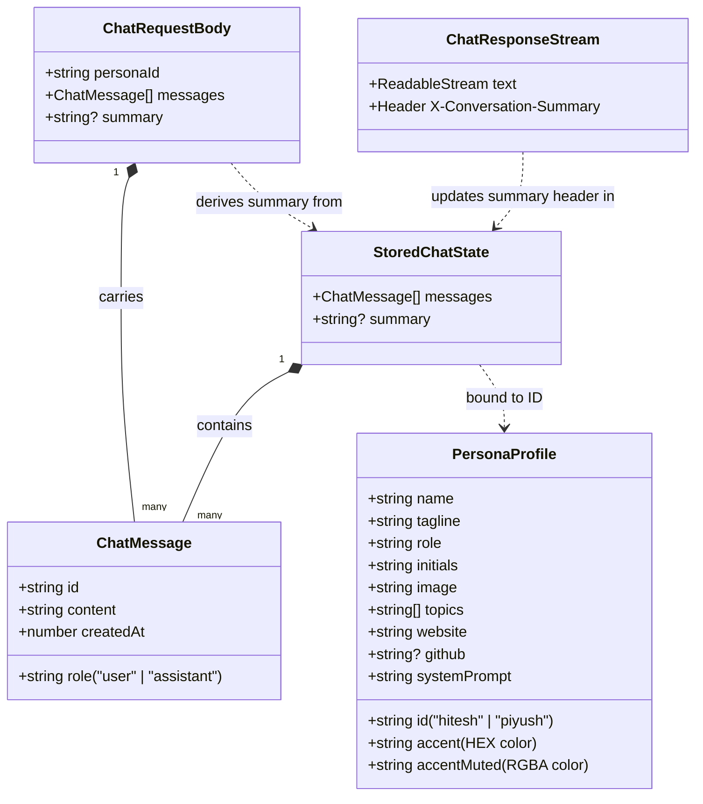

# Mentor Studio — AI Coding Mentor Simulator

Mentor Studio is a high-performance Next.js application that simulates interactive, Hinglish-speaking AI coding mentors styled after prominent tech instructors **Hitesh Choudhary** (Chai aur Code) and **Piyush Garg**. 

It features real-time response streaming, live web search RAG integration via Tavily, client-persisted sliding conversation summaries, and a premium custom hybrid light/dark mode UI layout.

---

## 📊 Data & Architecture Flow (ER-like Diagram)

Below is the Mermaid diagram representing the data entities, properties, client-side localStorage structures, and the communication request/response interface payload:



---

## 📂 File Structure

```text
persona/
├── app/
│   ├── api/
│   │   └── chat/
│   │       └── route.ts         # Serverless API streaming endpoint with RAG + summary
│   ├── favicon.ico
│   ├── globals.css              # Custom Tailwind directives & EchoAI-inspired themes
│   ├── layout.tsx               # Root layout loader with font optimizations & theme script
│   └── page.tsx                 # Core app shell layout with device panel container
├── components/
│   ├── chat/
│   │   ├── chat-studio.tsx      # Main workspace component (messages pane + text input)
│   │   ├── markdown-components.tsx # Custom ReactMarkdown custom rendering (syntax highlight)
│   │   ├── markdown-content.tsx # Markdown parser integration
│   │   ├── message-list.tsx     # Message bubbles & typing carets with dynamic colors
│   │   ├── persona-avatar.tsx   # Rounded status-ring avatars for Hitesh/Piyush
│   │   └── persona-sidebar.tsx  # Sidebar navigation matching the EchoAI design
│   └── ui/
│       ├── avatar.tsx           # Radix Avatar primitives
│       ├── badge.tsx            # Radix Badge primitives
│       ├── button.tsx           # Radix Button primitives
│       ├── scroll-area.tsx      # Radix ScrollArea primitives
│       ├── separator.tsx        # Radix Separator primitives
│       ├── textarea.tsx         # Custom Textarea component
│       ├── theme-toggle.tsx     # Dark/Light mode switcher with LocalStorage state
│       └── tooltip.tsx          # Radix Tooltip primitives
├── hooks/
│   └── use-persona-chat.ts      # LocalStorage persistence hook for messages & summaries
├── lib/
│   ├── context/
│   │   ├── build-context.ts     # Injects prompts, RAG context, and trims history
│   │   ├── summary.ts           # Compiles sliding conversations to compact memory blocks
│   │   └── tokens.ts            # Char-to-token estimators and system context limits
│   ├── personas/
│   │   ├── brevity.ts           # Strict word count constraints (max 100-120 words)
│   │   ├── hitesh.ts            # Hitesh Choudhary identity guidelines
│   │   ├── index.ts             # Persona profile roster registry
│   │   ├── piyush.ts            # Piyush Garg identity guidelines
│   │   └── types.ts             # Persona TypeScript shapes
│   ├── rag/
│   │   └── format-context.ts    # Custom text formatter for live web results
│   ├── search/
│   │   ├── tavily.ts            # Tavily Search API client
│   │   └── types.ts             # Search data shapes
│   └── utils.ts                 # Classname compiler utility (cn)
├── .env                         # API Key configuration (Mistral, Tavily)
├── package.json
└── tsconfig.json
```

---

## 🛠️ Tech Stack & Dependencies

- **Core Framework**: [Next.js 16 (App Router)](https://nextjs.org/) using [TypeScript](https://www.typescriptlang.org/)
- **Styling**: [Tailwind CSS v4](https://tailwindcss.com/)
- **Components**: [Radix UI primitives](https://www.radix-ui.com/)
- **Markdown & Highlight**: [react-markdown](https://github.com/remarkjs/react-markdown), [remark-gfm](https://github.com/remarkjs/remark-gfm), [rehype-highlight](https://github.com/rehypejs/rehype-highlight), [highlight.js](https://github.com/highlightjs/highlight.js)
- **AI Integration**: [OpenAI SDK](https://github.com/openai/openai-node) linking with [Mistral AI client API](https://api.mistral.ai)

---

## 🚀 Getting Started

### 1. Configuration
Create a `.env` file in the root of the project and add your API Keys:
```env
MISTRAL_API_KEY=your_key_here
TAVILY_API_KEY=your_key_here # Optional for Live Web Search
```

### 2. Install dependencies
```bash
npm install
```

### 3. Run development server
```bash
npm run dev
```

Open [http://localhost:3000](http://localhost:3000) to view the simulator!
