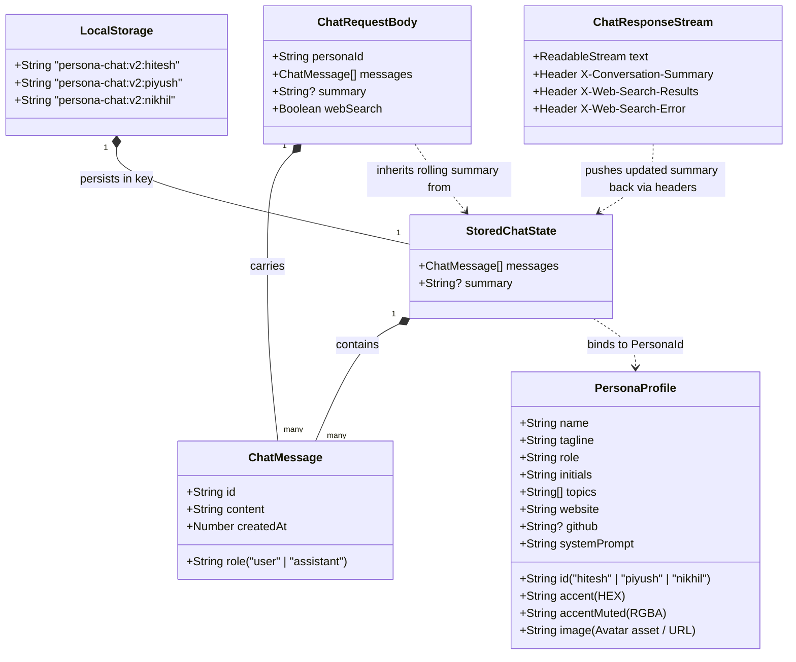

# Mentor Studio — AI Coding Mentor Simulator

Mentor Studio is a high-performance Next.js application that simulates interactive, Hinglish-speaking AI coding mentors styled after prominent tech instructors:
- **Hitesh Choudhary** (Chai aur Code)
- **Piyush Garg**
- **Nikhil Rathore** (@BlazeisCoding)

It features real-time response streaming, live web search RAG integration via Tavily, client-persisted sliding conversation summaries, and a premium custom hybrid light/dark mode UI layout.

---

## 📊 Application Architecture & Data Flows

### 1. Data Flow Sequence Diagram
The diagram below shows the complete lifecycle of a user prompt, from client UI compilation to Tavily web search (if enabled), context reconstruction (summaries and budget trimming), LLM inference streaming, and the header-based feedback loop updating client storage:

```mermaid
sequenceDiagram
    autonumber
    actor User as Student (UI)
    participant Client as Client State (usePersonaChat)
    participant LS as localStorage
    participant Server as Next.js API Route (/api/chat)
    participant Tavily as Tavily Search Engine
    participant Mistral as Mistral AI API

    User->>Client: Enters message & hits Send
    Client->>LS: Retrieve prior messages & rolling summary
    LS-->>Client: StoredChatState { messages, summary }
    Client->>Client: Appends User message & blank Assistant message
    
    rect rgb(30, 41, 59)
        note over Client, Server: Web Search & RAG Flow (if toggled)
        Client->>Server: POST /api/chat { personaId, messages, summary, webSearch: true }
        Server->>Tavily: Fetch relevant snippets for user prompt
        Tavily-->>Server: JSON list of web search matches
        Server->>Server: Format snippets into System RAG context blocks
    end

    rect rgb(15, 23, 42)
        note over Server: Context Assembly & Pruning
        Server->>Server: Normalize history & calculate token counts (estimateTokens)
        Server->>Server: Select messages within token budget (kept vs dropped)
        Server->>Server: If messages dropped: buildDroppedSummary() & update rolling summary
        Server->>Server: Compile final array: [SystemPrompt, RAGContext?, RollingSummary?, KeptMessages...]
    end

    Server->>Mistral: Request chat completion stream (mistral-small-latest)
    Mistral-->>Server: Real-time tokens (ReadableStream)
    
    Note over Server, Client: Headers contain updated rolling summary & search metadata
    Server-->>Client: HTTP response with X-Conversation-Summary header + text stream
    
    loop Stream Reading
        Server-->>Client: Send response token chunk
        Client->>User: Render streamed text token in chat bubble
    end
    
    Client->>Client: Save fully completed response
    Client->>LS: Persist updated StoredChatState { messages, summary: updatedSummary }
```



### 2. Client Database Schema & ER Diagram
The system operates serverless and persists conversation history locally in the browser. It features a schema-migration system designed to upgrade legacy representations (flat message arrays) to versioned rolling state objects:



---

## 📂 Detailed Folder & File Structure

Here is a full breakdown of the files in this project and their responsibilities:

```text
persona/
├── app/
│   ├── api/
│   │   └── chat/
│   │       └── route.ts             # API streaming endpoint. Handles web search fetching, context construction (pruning & summary generation), and streams response tokens back using Mistral client.
│   ├── favicon.ico
│   ├── globals.css                  # Custom global styles, fonts, and dark/light themes. Includes custom classes for EchoAI-like interface layouts.
│   ├── layout.tsx                   # Main layout loader with viewport settings, font preloads, and theme configuration script to prevent FOUC (Flash of Unstyled Content).
│   └── page.tsx                     # Core entry page shell layout containing components inside a responsive grid structure.
│
├── components/
│   ├── chat/
│   │   ├── chat-studio.tsx          # Primary workspace component that controls the central active chat workspace, suggestion cards, loading state, streaming response state, and message input.
│   │   ├── markdown-components.tsx  # ReactMarkdown custom renderers (e.g. customized pre/code syntax highlighting, lists, and tables).
│   │   ├── markdown-content.tsx     # Wrapper component setting up ReactMarkdown with remark-gfm and rehype-highlight plugins.
│   │   ├── message-list.tsx         # Displays conversation list, typing indicators, user avatar fallback ("ME"), and custom mentor style borders.
│   │   ├── persona-avatar.tsx       # Profile component featuring customized color status-rings matching the selected mentor.
│   │   └── persona-sidebar.tsx      # Sidebar navigation for switching between mentors, resetting conversations, and showing message counts.
│   └── ui/
│       ├── avatar.tsx               # UI primitive for Radix Avatar wrapper.
│       ├── badge.tsx                # UI primitive for badges.
│       ├── button.tsx               # UI primitive for customized, styled buttons.
│       ├── card.tsx                 # UI primitive for suggestions and content containers.
│       ├── scroll-area.tsx          # UI primitive for scrollable regions utilizing Radix ScrollArea.
│       ├── separator.tsx            # UI primitive for visual dividing lines.
│       ├── textarea.tsx             # Customized textarea component.
│       ├── theme-toggle.tsx         # Theme toggle switch component with local storage synchronization.
│       └── tooltip.tsx              # UI primitive for hover Tooltips.
│
├── hooks/
│   └── use-persona-chat.ts          # custom client hook managing state retrieval, hydration, serialization to localStorage, clear actions, and parsed response headers (rolling summaries).
│
├── lib/
│   ├── context/
│   │   ├── build-context.ts         # Assembles system prompt, rolling summary, RAG context, and trims past messages under the token budget to fit model context.
│   │   ├── summary.ts               # Core summarization engine generating heuristic summaries of dropped turns (without extra LLM cost) and merging summary chunks.
│   │   └── tokens.ts                # Token estimators using char-to-token algorithms, defining constraints like context limits.
│   ├── personas/
│   │   ├── brevity.ts               # Global constraints applied to all system prompts to enforce conciseness (max 100-120 words).
│   │   ├── hitesh.ts                # Hitesh Choudhary mentor definition (pronoun guidelines, typical Hinglish phrases, system prompt).
│   │   ├── nikhil.ts                # Nikhil Rathore mentor definition (pronoun guidelines, typical Hinglish phrases, system prompt).
│   │   ├── piyush.ts                # Piyush Garg mentor definition (pronoun guidelines, typical Hinglish phrases, system prompt).
│   │   ├── index.ts                 # Registry for compiling and resolving the list of available mentors.
│   │   └── types.ts                 # TypeScript interfaces defining PersonaProfile, ChatMessage, and PersonaId.
│   ├── rag/
│   │   └── format-context.ts        # Structures Tavily search API snippets into clean system-context messages.
│   ├── search/
│   │   ├── tavily.ts                # Tavily Search API client wrapper.
│   │   └── types.ts                 # TypeScript shapes for search queries and responses.
│   └── utils.ts                     # Tailwind class merging compiler utility.
│
├── .env.example                     # Reference config specifying required keys (MISTRAL_API_KEY, TAVILY_API_KEY).
├── components.json                  # Shadcn-UI configuration file.
├── tsconfig.json                    # Compiler settings configuration for TypeScript.
├── tailwind.config.ts               # Configurations for Tailwind CSS styles.
└── package.json                     # Lists scripts and project dependencies.
```

---

## 🛠️ Technical Implementation Deep Dives

### 1. Sliding Window & Summarization Heuristic
To manage the input token size when using `mistral-small-latest`, the application implements an automatic context-pruning mechanism:
- **Token Estimation (`lib/context/tokens.ts`)**: Uses a safe average character-to-token ratio (approx. 4 characters = 1 token) to estimate size.
- **Budgeting (`lib/context/build-context.ts`)**: Keeps the recent message array size bounded within `maxHistoryTokens` (default: `1400` tokens). It walks backwards from the latest message, always retaining a mandatory minimum of recent turns.
- **Pruning & Summarization (`lib/context/summary.ts`)**: When older messages are pruned out of the active message list, they are sent to `buildDroppedSummary()`. This utility extracts key metadata (the questions asked by the user, and the first lines of the mentor's explanation) to compile a compressed summary of the historical context.
- **Header Feedback Loop**: The new summary segment is merged with the existing rolling summary block and sent back to the client inside the `X-Conversation-Summary` HTTP header, which is then updated in the client's `localStorage` state for the next turn.

### 2. Tavily Web Search RAG Integration
When the user turns on the "Web Search" toggle:
- The system extracts the most recent user question.
- It triggers a backend query using the Tavily Search client (`lib/search/tavily.ts`) fetching up to 5 highly relevant web results.
- The results (comprising titles, URLs, and snippet contents) are formatted into a system message block (`lib/rag/format-context.ts`) to supplement the model's knowledge with live web data.
- If Tavily limits are reached or search fails, a warning is returned in the response header `X-Web-Search-Error` which displays a visual error message bubble to the user.

### 3. Mentor Voice & Respectful Pronoun Policy
Each simulated mentor possesses custom system prompts designed to model their unique tech-educator identities:
- **Hitesh Choudhary**: Features warm, project-focused YouTube instructor guidance starting with his trademark greeting *"Haanji, kaise ho aap sabhi"*.
- **Piyush Garg**: Features founder-style direct technical mentoring, prioritizing backend engineering, Docker, GenAI, and system designs.
- **Nikhil Rathore**: Features indie-hacker/builder voice, focused on shipping fast, database modeling (Drizzle/Postgres), and building in public.
- **Respectful "Aap" Pronoun Rule**: Across all mentors, when communicating in Hinglish or Hindi, they must address the user using respectful pronouns (**"aap"**, **"aapko"**, **"aapki"**, **"aapne"**, **"aapka"**). They are strictly forbidden from using informal pronouns, greetings, or slangs like *yaar*, *bro*, *tu*, *tum*, *tere*, *tereko*, *tujhe*, and similar terms.

---

## 🚀 Getting Started

### 1. Configuration
Create a `.env` file in the root of the project and add your API Keys:
```env
MISTRAL_API_KEY=your_key_here
TAVILY_API_KEY=your_key_here # Optional (required for Web Search RAG)
```

### 2. Install dependencies
```bash
npm install
```

### 3. Run development server
```bash
npm run dev
```

Open [http://localhost:3000](http://localhost:3000) to view the simulator!
